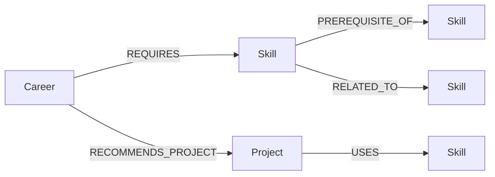

# SkillGraph AI — Career & Skill Relationship Explorer

A take-home assignment for **Wexa AI** demonstrating graph data modeling, multi-hop traversals, and a polished full-stack web application backed by **CognoDB** (openCypher over Bolt, compatible with the official Neo4j Python driver).

> **"If I want to become a particular type of software professional, what skills should I learn, in what order, and how are those skills connected?"**

---

## 1. Project Overview

**SkillGraph AI** is an interactive career exploration tool that helps users:

- Browse software career paths (Frontend, Backend, Full Stack, AI Engineer, Data Analyst)
- Visualize how careers connect to skills through a graph
- Generate **ordered learning paths** by traversing skill prerequisite chains
- Discover **multi-hop connections** between any two technologies

The application is built to showcase why graph databases excel at relationship-heavy queries that would be awkward with recursive SQL joins.

---

## 2. Why a Graph Database?

Relationships are first-class citizens in this application. Every feature depends on traversing connections:

| Question | Graph Approach |
|---|---|
| What skills must I learn before React? | Follow `PREREQUISITE_OF` edges backward |
| How is React connected to SQL? | `shortestPath` across mixed relationship types |
| Which careers share similar skills? | Traverse `REQUIRES` edges from shared skills |
| What learning path leads to AI Engineer? | Multi-hop `PREREQUISITE_OF` traversal from career skills |

In a relational database, these queries require recursive CTEs, multiple self-joins, or application-level BFS loops. With CognoDB, a single parameterized Cypher query expresses the intent directly:

```cypher
MATCH path = (foundation:Skill)-[:PREREQUISITE_OF*1..5]->(target:Skill)
WHERE target.name = $skill_name
RETURN path
```

The graph model maps naturally to how humans think about skills: nodes are entities, edges are relationships with semantic meaning.

---

## 3. Architecture

```text
┌─────────────────┐     HTTP/REST      ┌─────────────────┐     Bolt Protocol    ┌─────────────────┐
│                 │  ───────────────►  │                 │  ─────────────────►  │                 │
│  React Frontend │                    │  FastAPI Backend│                      │  CognoDB Cloud  │
│  (Vite + TS)    │  ◄───────────────  │  (Python)       │  ◄─────────────────  │  (Graph DB)     │
│                 │     JSON API       │                 │     openCypher       │                 │
└─────────────────┘                    └─────────────────┘                      └─────────────────┘
        │                                      │
        │ React Flow                           │ neo4j Python driver
        │ graph visualization                  │ parameterized queries
        └──────────────────────────────────────┘
```

**Backend layers:**

- `config.py` — environment variables via Pydantic Settings
- `database.py` — Neo4j driver lifecycle (init, session, close)
- `queries.py` — all parameterized Cypher queries in one module
- `routers/` — FastAPI route handlers (careers, skills, graph)
- `scripts/seed_database.py` — seed data with parameterized CREATE queries

**Frontend layers:**

- `pages/` — Home, CareerExplorer, Connections
- `components/` — SkillGraph (React Flow), LearningPath, SearchBar, etc.
- `services/api.ts` — typed API client

---

## 4. Graph Data Model



### Node Types

| Label | Properties | Count |
|---|---|---|
| `Career` | name, description, category, difficulty | 5 |
| `Skill` | name, category, description, difficulty | 25 |
| `Project` | name, description, difficulty | 10 |

### Relationship Types

| Relationship | From → To | Purpose |
|---|---|---|
| `REQUIRES` | Career → Skill | Skills needed for a career |
| `PREREQUISITE_OF` | Skill → Skill | Learning order (foundation → advanced) |
| `RELATED_TO` | Skill ↔ Skill | Cross-domain connections for path finding |
| `RECOMMENDS_PROJECT` | Career → Project | Portfolio project suggestions |
| `USES` | Project → Skill | Skills applied in a project |

**Seed data totals:** 5 careers, 25 skills, 10 projects, 90+ relationships.

---

## 5. Setup Instructions

### Prerequisites

- Python 3.11+
- Node.js 18+
- A CognoDB Cloud account ([cognodb.cloud](https://cognodb.cloud))

### Step 1: Create a CognoDB Instance

1. Sign up at [cognodb.cloud](https://cognodb.cloud)
2. Create a free cloud instance
3. Note your **Bolt URI**, **username**, and **password** from the instance dashboard

### Step 2: Configure Environment Variables

```bash
# Backend
cd backend
cp .env.example .env
# Edit .env with your CognoDB credentials:
#   COGNODB_URI=bolt+s://your-instance.databases.cognodb.cloud
#   COGNODB_USERNAME=cognodb
#   COGNODB_PASSWORD=your-password
```

```bash
# Frontend (optional — defaults to proxy via Vite)
cd frontend
cp .env.example .env
```

### Step 3: Install Dependencies

```bash
# Backend
cd backend
python -m venv venv

# Windows
venv\Scripts\activate

# macOS/Linux
source venv/bin/activate

pip install -r requirements.txt

# Frontend
cd ../frontend
npm install
```

### Step 4: Seed the Database

```bash
cd backend
python -m scripts.seed_database
```

Expected output:

```text
Connected to CognoDB.
Clearing existing data...
Creating 5 careers...
Creating 25 skills...
Creating 10 projects...
Creating 90+ relationships...

Seed complete!
  Careers:       5
  Skills:        25
  Projects:      10
  Relationships: 90+
```

### Step 5: Run the Backend

```bash
cd backend
uvicorn app.main:app --reload --port 8000
```

Verify: [http://127.0.0.1:8000/api/health](http://127.0.0.1:8000/api/health)

API docs: [http://127.0.0.1:8000/docs](http://127.0.0.1:8000/docs)

### Step 6: Run the Frontend

```bash
cd frontend
npm run dev
```

Open: [http://localhost:5173](http://localhost:5173)

---

## 6. Main Graph Queries

All queries live in `backend/app/queries.py` and use driver parameters (`$career_name`, `$source_name`, etc.).

### Query 1: Get Career Details

Returns a career with directly required skills and recommended projects.

```cypher
MATCH (c:Career {name: $career_name})
OPTIONAL MATCH (c)-[:REQUIRES]->(s:Skill)
OPTIONAL MATCH (c)-[:RECOMMENDS_PROJECT]->(p:Project)
RETURN c, collect(DISTINCT s) AS skills, collect(DISTINCT p) AS projects
```

### Query 2: Multi-hop Learning Path

Traverses `PREREQUISITE_OF` chains up to 5 hops for every skill required by a career, then orders results by depth.

```cypher
MATCH (c:Career {name: $career_name})-[:REQUIRES]->(required:Skill)
OPTIONAL MATCH prereq_path = (foundation:Skill)-[:PREREQUISITE_OF*1..5]->(required)
WITH required, prereq_path
WITH required,
     CASE WHEN prereq_path IS NULL THEN [required]
          ELSE nodes(prereq_path) END AS chain_nodes
UNWIND chain_nodes AS node
WITH DISTINCT node
RETURN node.name AS name, ...
ORDER BY depth DESC, node.difficulty ASC, name ASC
```

**Why this demonstrates graph power:** A single query walks arbitrary-depth prerequisite chains for multiple target skills simultaneously — no recursive CTEs or application-level graph walking required.

### Query 3: Find Connections Between Skills

Uses `shortestPath` to find how two skills connect through any relationship type within 6 hops.

```cypher
MATCH (source:Skill {name: $source_name}), (target:Skill {name: $target_name})
MATCH path = shortestPath((source)-[*..6]-(target))
RETURN path
```

**Why this demonstrates graph power:** Finding paths through mixed relationship types (`PREREQUISITE_OF`, `RELATED_TO`, and potentially through shared careers/projects) in SQL would require multiple UNION queries or recursive CTEs with complex edge-type handling.

---

## 7. API Endpoints

| Method | Endpoint | Description |
|---|---|---|
| `GET` | `/api/health` | Health check with database status |
| `GET` | `/api/careers` | List all careers |
| `GET` | `/api/careers/{name}` | Career details with skills & projects |
| `GET` | `/api/careers/{name}/learning-path` | Ordered learning path |
| `GET` | `/api/careers/stats/summary` | Dashboard statistics |
| `GET` | `/api/careers/search?q=` | Search careers and skills |
| `GET` | `/api/skills` | List all skills |
| `GET` | `/api/skills/{name}` | Skill details with prerequisites |
| `GET` | `/api/graph/career/{name}` | Graph nodes/edges for visualization |
| `GET` | `/api/graph/connections?source=&target=` | Shortest path between skills |

---

## 8. Screenshots

> Add screenshots here after running the application locally.

| Page | Screenshot |
|---|---|
| Home / Dashboard | `` |
| Career Explorer | `` |
| Skill Graph | `` |
| Learning Path | `` |
| Connection Explorer | `` |

---

## 9. Trade-offs and Future Improvements

| Area | Current Approach | Future Improvement |
|---|---|---|
| Graph layout | Simple grid layout in React Flow | Force-directed layout (dagre/elk) for large graphs |
| Learning path ordering | Depth-based topological sort from Cypher | Weighted paths considering difficulty and time estimates |
| Search | Simple `CONTAINS` match | Full-text index search with ranking |
| Authentication | None (demo scope) | User accounts to save progress and custom paths |
| Skill gaps | Not tracked | "What you know vs. what you need" personalized paths |
| Data updates | Manual seed script | Admin API or CSV import for graph maintenance |
| Testing | Manual verification | pytest for API, Vitest for frontend components |

These are deliberate scope choices for a 48-hour take-home — the core graph traversal features are fully functional and interview-ready.

---

## License

Built as a take-home assignment for Wexa AI. Not licensed for commercial use.
